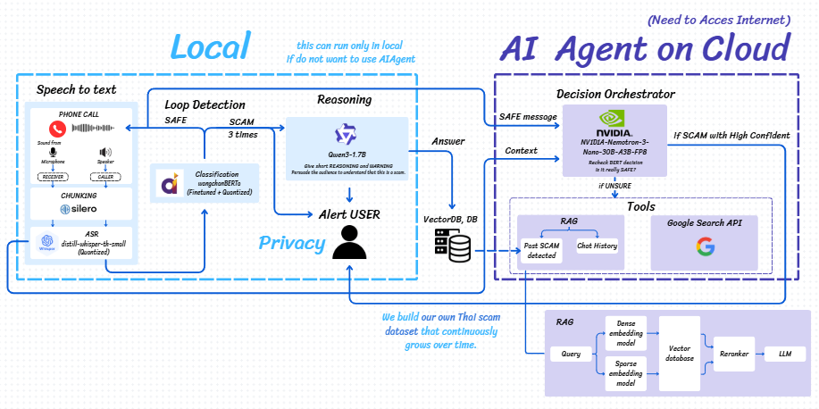

> ## 🌐 **[Live Demo Available Here!](https://stoloniferous-zinciferous-trula.ngrok-free.dev/)**

# 🛡️ Scam Call Detector

An AI-powered real-time scam call detection system using Hybrid AI Pipeline (ASR + BERT + SLM).

## � The Real-World Problem

Call center scam gangs are a growing threat in Thailand, impersonating trusted authorities such as banks, cyber police, and government officials. These fraudsters use psychological manipulation techniques to create a sense of urgency, pressuring victims into making hasty and costly decisions. In 2025 alone, over **20 thousand victims** were affected, resulting in total damages exceeding **฿22 billion**. This alarming trend underscores the urgent need for AI-powered real-time detection to protect users before they fall victim.

## 📊 System Architecture



The system operates in two modes:
- **Local Mode**: All AI models run on-device for privacy-first detection
- **Agent Mode**: Cloud-based AI Agent with RAG and external search for enhanced accuracy

### 🔄 How It Works

1. **Audio Input** → The system captures the caller's voice from the phone speaker
2. **Voice Activity Detection** → Silero VAD segments the audio stream, detecting speech vs. silence
3. **Speech-to-Text** → Quantized distill-whisper-th ASR converts Thai speech to text in real-time
4. **Scam Classification** → Fine-tuned WangchanBERTa analyzes the text for scam patterns
5. **Alert Trigger** → If "SCAM" is detected **3 times**, Qwen3-1.7B generates a persuasive warning
6. **User Notification** → The system alerts the user with an explanation before they become a victim

### 🤔 Why Not Use Large LLM Alone?

| Approach | Speed | Cost | Connectivity | Thai Support |
|----------|-------|------|--------------|--------------|
| **GPT-4 / Claude** ❌ | Slow (2-3s) | Expensive (API cost) | Requires Internet | Not specialized |
| **BERT + SLM** ✅ | Fast (~1.7s total) | Free (on-premise) | Works offline | Fine-tuned specialized |

Large LLMs are powerful but impractical for real-time on-device detection. Our hybrid approach combines the speed of BERT for pattern detection with the reasoning capability of a Small Language Model (SLM) for generating human-readable explanations—all running locally without API costs or internet dependency.

## 📋 Prerequisites

- Python 3.9+
- GPU with CUDA support (for Production mode)
- [Ollama](https://ollama.ai/) (for SLM)

## 🏗️ Project Structure

```
scam-call-detector/
├── app/
│   ├── __init__.py
│   ├── config.py           # Configuration settings
│   ├── models.py           # AI Models loader
│   ├── agent_graph.py      # LangGraph Agent
│   ├── pipeline_hybrid.py  # Main AI Pipeline
│   └── main.py             # FastAPI server
├── static/
│   ├── audio/              # Audio files for demo
│   ├── css/
│   │   ├── style.css       # Demo page styling
│   │   └── pitch.css       # Main page styling
│   ├── flow/               # Architecture diagrams
│   └── js/
│       ├── script.js       # Demo page logic
│       └── pitch.js        # Main page logic
├── templates/
│   ├── index.html          # Demo page
│   └── pitch.html          # Main presentation page
├── requirements.txt
├── run_demo.bat
└── README.md
```

## 🚀 Getting Started

### 1. Install Dependencies
```bash
pip install -r requirements.txt
```

### 2. Set Environment Variables
```bash
# Create .env file from template
cp .env.example .env

# Edit .env and fill in the correct values:
# - HF_TOKEN: Your Hugging Face token
# - CALLER_IDENTIFIER_PATH: Path to caller identifier model
# - SCAM_DETECTOR_PATH: Path to scam detector model
```

### 3. Prepare Audio Files
- Place audio files (`.wav`) in the `static/audio/` folder

### 4. Configure Settings
Set via environment variables or edit `app/config.py`:
- `USE_MOCK_AI=true` for Demo Mode (no real model loading)
- `USE_MOCK_AI=false` for Production (requires GPU and models)

### 5. Run the Server
```bash
# Windows
run_demo.bat

# Or manually
uvicorn app.main:app --reload --host 0.0.0.0 --port 8000
```

### 6. Open in Browser
Navigate to `http://localhost:8000`

## ✨ Features

- **Dark Theme UI** - Modern, clean design
- **Real-time WebSocket** - Background processing with live updates
- **Live Transcription** - Audio-synced transcript display
- **Scam Alerts** - Toast notifications and warning panels
- **Hybrid Detection** - BERT pattern detection + SLM reasoning
- **Privacy-First** - On-device AI processing option

## 🔧 AI Models Used

| Model | Purpose | Size |
|-------|---------|------|
| **Silero VAD** | Voice Activity Detection | 2MB |
| **distill-whisper-th** | Speech-to-Text (Thai) | 0.2B (Quantized) |
| **WangchanBERTa** | Caller Identification & Scam Detection | 0.1B (Quantized) |
| **Qwen3-1.7B** | Explanation Generator | 1.7B |

## 📈 Performance Metrics

Tested on 274 rows of new scam patterns (Jan 5, 2026):

| Metric | Score |
|--------|-------|
| Accuracy | 84% |
| Precision | 85% |
| Recall | 82% |
| F1-Score | 83% |

## 🔒 Privacy

- All models can run locally on-device
- No audio data is sent to external servers
- NER masking for cloud mode to protect personal information
- PDPA compliant

## 📝 Notes

- **GPU** required for loading real models
- **Ollama** required for Qwen SLM
- Mock Mode uses simulated data for demo purposes
- Web demo uses audio file input instead of live microphone

## 👥 Contributors

- [GitHub Repository](https://github.com/suwapatsuw3/scam-call-detector)

## 📄 License

Built with ❤️ for KBTG Hackathon 2026
